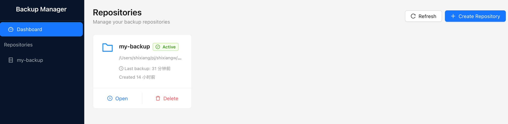
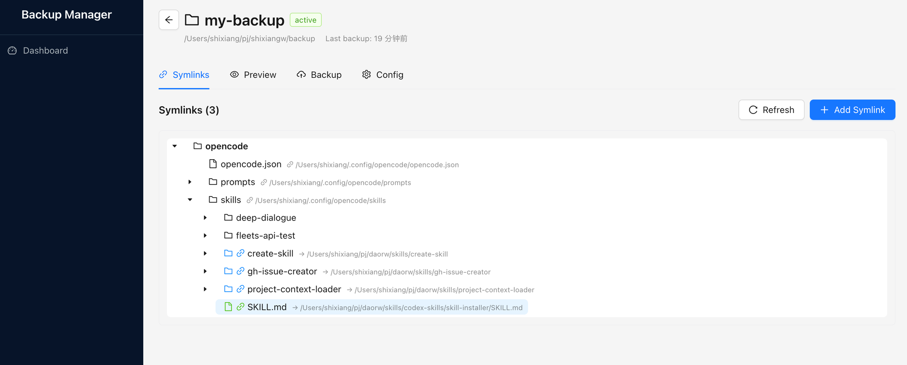
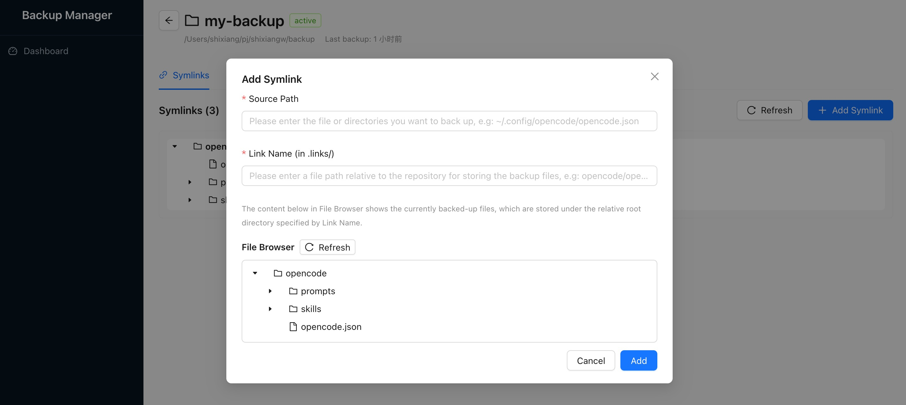
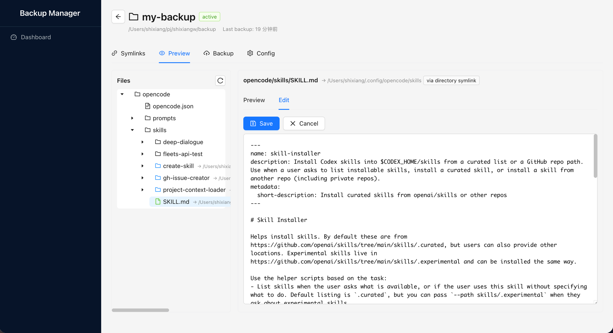
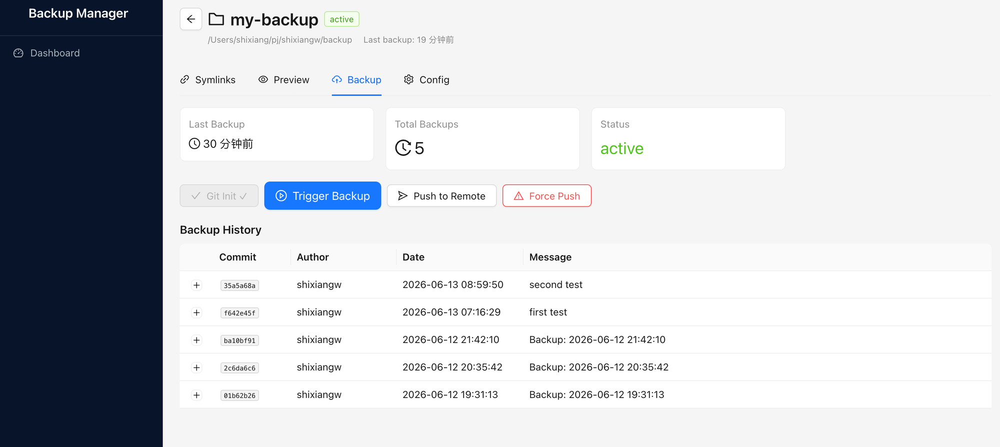
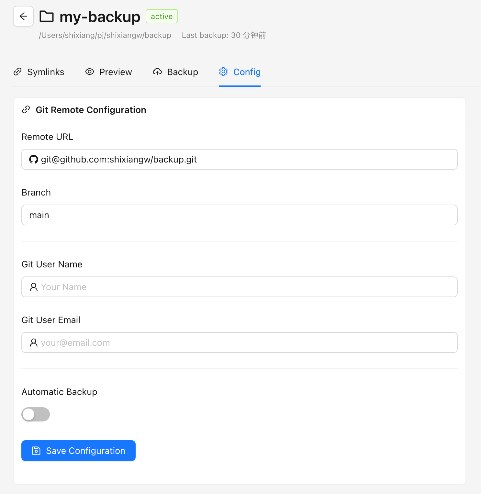
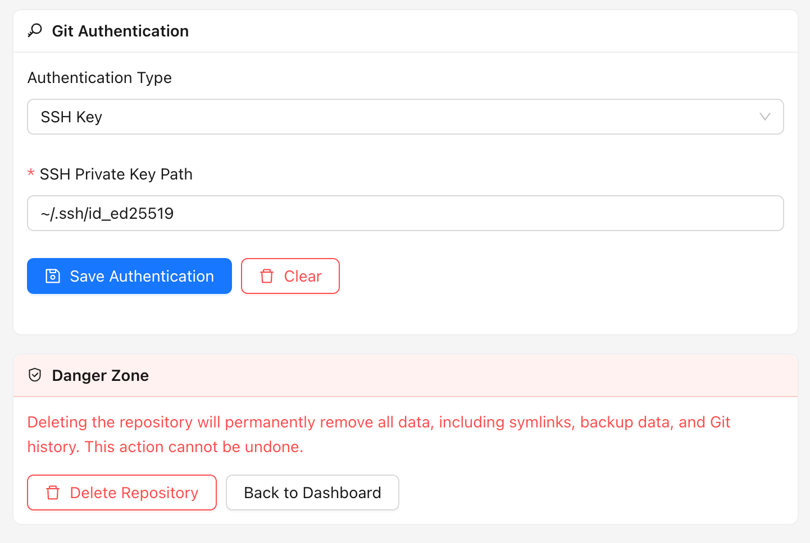

# Backup Manager - Quick Start Guide

> 🇨🇳 [中文文档](zh/quick-start.md)

## Overview

Backup Manager is a visual management tool for file/directory aggregated backup. Based on Git's reverse tracking mode (whitelist mechanism), it allows users to manage backups intuitively by "specifying what to back up" rather than "what to exclude".

## Dashboard

The main interface shows the status and basic information of all backup repositories.

- View all backup repositories
- View repository status (active/inactive)
- Quick actions (Open, Delete)
- Create a new repository

## Repository Management

### Creating a Repository

1. Click the "+ Create Repository" button in the top right of the Dashboard
2. Enter the repository name and path
3. Configure basic settings

### Repository Detail View

After opening a repository, you can see four main tabs: **Symlinks**, **Preview**, **Backup**, **Config**.

## Symlinks Tab

The Symlinks tab displays all files and directories backed up via symlinks.

### Features:
- Tree view of symlink hierarchy
- Click "+ Add Symlink" to add a new symlink
- Click "Refresh" to refresh the list
- View the original path of the source file

### Adding a Symlink:

Click the "+ Add Symlink" button in the Symlinks tab to open the Add Symlink dialog:

1. **Source Path**: Enter or browse to select the file or directory you want to back up (e.g. `~/.config/opencode/opencode.json`)
2. **Link Name**: Specify the relative path within `.links/` for storing the backup files (e.g. `opencode/opencode.json`). This defines the directory structure inside the repository.
3. **File Browser**: Preview the currently backed-up files under the specified Link Name root directory.
4. Click **Add** to confirm, or **Cancel** to discard.

## Preview Tab

The Preview tab allows you to directly view and edit backed up files.

### Features:
- Browse the file structure
- Preview file content
- Click "Edit" to edit the file
- Click "Save" to save changes
- View file metadata

### File Operations:
1. Select a file in the left tree view
2. Preview the file content on the right
3. Click "Edit" to enter edit mode
4. Click "Save" to save changes

## Backup Tab

The Backup tab displays backup history and backup control buttons.

### Features:
- View the last backup time
- View the total number of backups
- Monitor backup status
- Execute backup operations

### Backup Controls:
- **Git Init**: Initialize the Git repository
- **Trigger Backup**: Manually trigger a backup
- **Push to Remote**: Push to the remote repository
- **Force Push**: Force push (use with caution)

### Backup History:
- View the commit hash
- View the commit author
- View the commit date
- View the commit message

## Config Tab

The Config tab manages repository configuration settings.

### Configuration Options:
- **Remote URL**: Git remote repository address
- **Branch**: Target branch for backup
- **Git User Name**: Commit author name
- **Git User Email**: Commit author email
- **Automatic Backup**: Enable/disable scheduled automatic backup

## Git Authentication & Danger Zone

Configure Git authentication information, and the danger zone.

### Authentication Types:
- **SSH Key**: Authenticate using an SSH private key
- **HTTPS**: Authenticate using username/password

### SSH Key Configuration:
1. Select "SSH Key" from the Authentication Type dropdown
2. Enter the SSH private key path (e.g. `~/.ssh/id_ed25519`)
3. Click "Save Authentication"

### Clear Authentication:
- Click "Clear" to delete saved authentication information

### Danger Zone ⚠️
- **Delete Repository**: Permanently delete all repository data (symlinks, backup data, Git history). This operation is irreversible.
- **Back to Dashboard**: Return to the repository list

## Getting Started Workflow

1. **Install & Run**: Download and start Backup Manager
2. **Create Repository**: Set up your first backup repository
3. **Add Symlinks**: Specify the files/directories to back up
4. **Configure Git**: Set up remote repository and authentication information
5. **Run Backup**: Execute the first backup
6. **Monitor Status**: View backup status and history

## Best Practices

- Start with a few important files
- Use meaningful commit messages
- Configure automatic backup for critical data
- Regularly verify backup integrity
- Safely store authentication credentials

## Troubleshooting

### Common Issues:
- **Backup Failed**: Check Git configuration and authentication information
- **Symlinks Not Displaying**: Verify file permissions and paths
- **Remote Push Failed**: Ensure the remote repository exists and credentials are correct

### Getting Help:
- Check the application logs for detailed error information
- Ensure all dependencies are properly installed
- Ensure file permissions are correct
