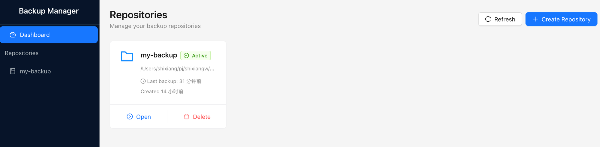
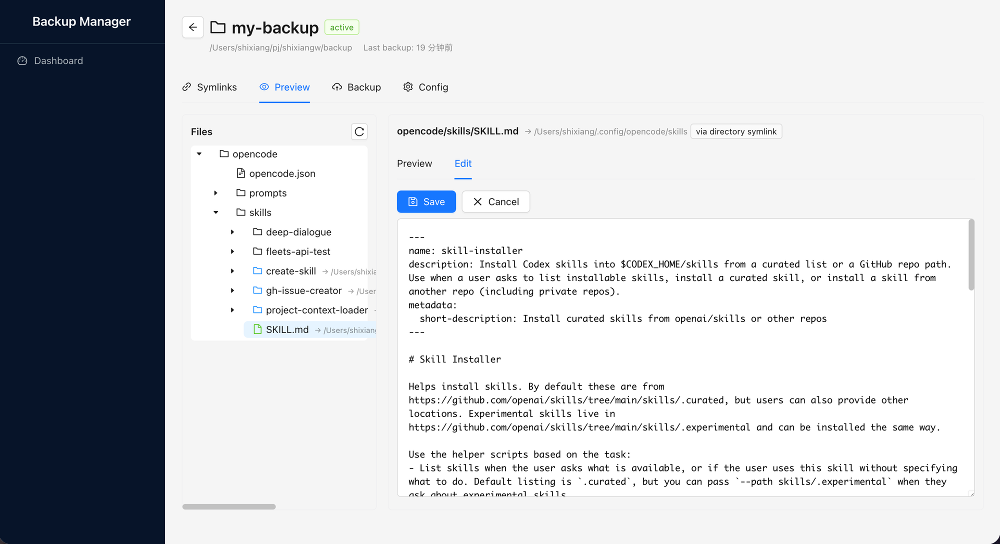
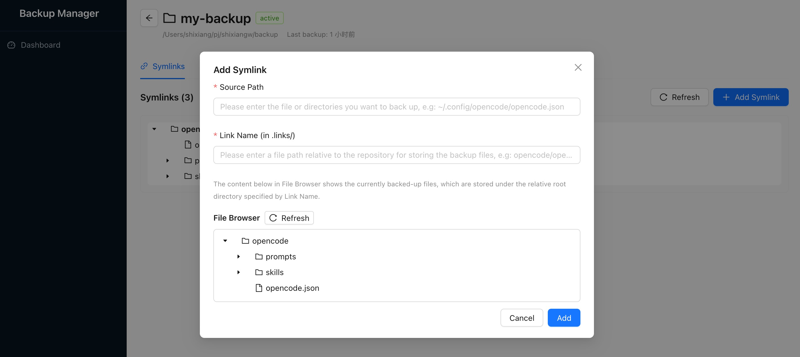
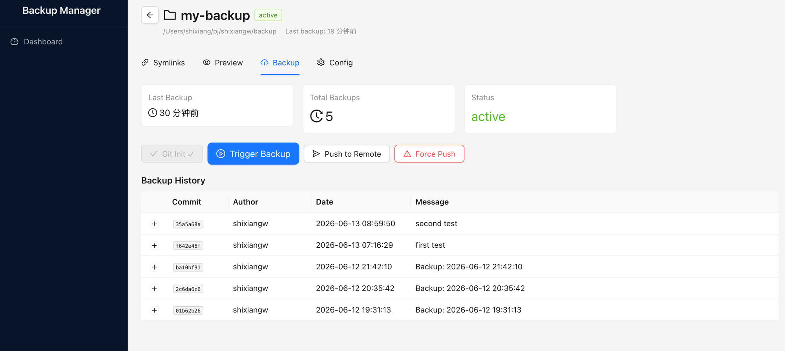
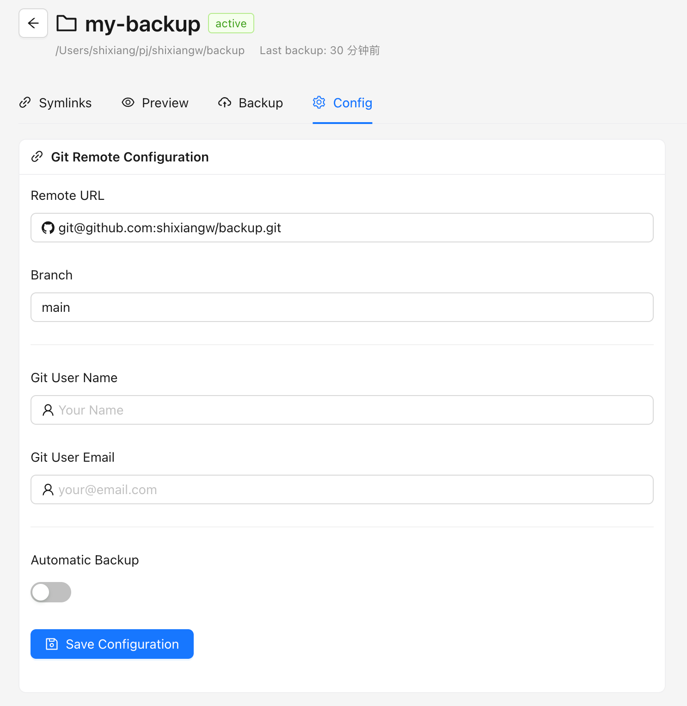
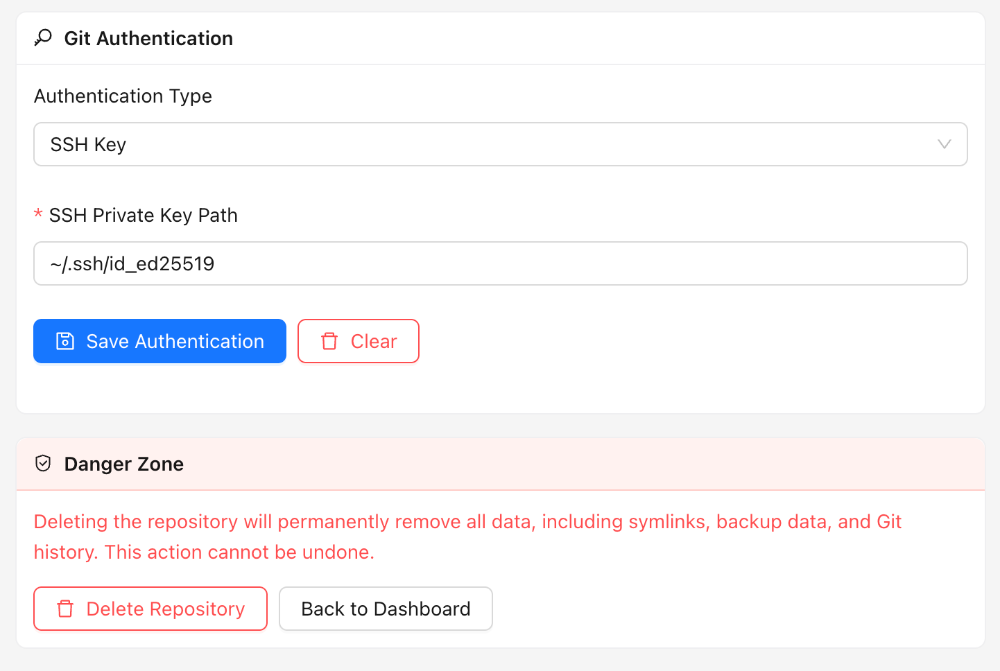

# Backup Manager - Quick Start Guide

## Overview

Backup Manager 是一个文件/目录聚合备份可视化管理工具。基于 Git 的反向追踪模式（白名单机制），让用户以"指定要备份什么"而非"排除什么"的直观方式管理备份。

## Dashboard

主界面展示所有备份仓库的状态和基本信息。



- 查看所有备份仓库
- 查看仓库状态（active/inactive）
- 快速操作（Open, Delete）
- 创建新仓库

## 界面语言

使用侧边栏底部的语言切换器选择英文（`en`）或简体中文（`zh-CN`）。默认语言为英文。后端会把选择作为 `language` 保存到应用级配置 `~/.config/backup-manager/config.json`，因此再次打开 UI 时仍会使用该语言。

## Repository Management

### Creating a Repository

1. 点击 Dashboard 右上角 "+ Create Repository" 按钮
2. 输入仓库名称和路径
3. 配置基本设置

### Repository Detail View

打开仓库后，可以看到四个主要标签页：**Browse**、**Entries**、**Backup**、**Config**。

## Browse 标签页

Browse 标签页展示仓库在 `data/` 下的真实内容，并允许预览与编辑。



### 功能：
- 浏览 `data/` 目录树
- 每个节点带徽标：是条目 / 未备份 / 存在链接漂移
- 预览文件内容
- 点击 "Edit" 编辑，"Save" 就地写入
- 查看文件元数据

### 文件操作：
1. 在左侧树形视图选择文件
2. 右侧预览文件内容
3. 点击 "Edit" 进入编辑模式
4. 点击 "Save" —— 因为每个链接都是指向同一文件的软链接，该条目的所有本机路径会立即更新

## Entries 标签页

每个被备份的文件或目录都是一个**条目（Entry）**。**条目**就是白名单里的一条：它存在于清单中，就代表「被备份」。**链接（Link）** 则是绑定到该条目的一个本机路径，形态是指向 `data/<repo_path>` 的软链接。一个条目可以有 **0..N 条链接**，且全部**完全等价** —— 同一目标、同一语义。

没有链接的条目完全合法：内容在仓库里，只是本机暂时没有视图。

```
   ● ~/.config/opencode/opencode.json        MacBook Pro     [移除]
   ● ~/Desktop/opencode.json                 MacBook Pro     [移除]
   ○ ~/work/opencode/opencode.json           MacBook-Pro-2   其他设备
```

### 功能：
- 条目按 `repo_path` 分组，可展开查看每条链接
- 逐链接状态：`ok` / `missing` / `wrong_target` / `replaced` / `dangling` / `occupied`
- 按设备查看链接状态，并标明哪些链接属于当前机器
- 一致性巡检与一键修复

### 创建条目（adopt）：

点击 Entries 标签页中的 "+ New Entry"：



1. **Source Path**：输入或浏览选择要备份的文件或目录路径（如 `~/.config/opencode/opencode.json`）
2. **Repo Path**：仓库内的逻辑路径（如 `opencode/opencode.json`）。默认取文件名，且不得与其它条目路径重叠
3. 请阅读警告：**内容将被移入仓库，此位置会被替换为软链接**
4. 点击 **Create**。原位置现在承载该条目的第一条链接

### 分发条目（添加链接）：

选中条目 → "Add Link" → 选择一个本机路径。会在该处创建指向 `data/<repo_path>` 的软链接，不复制任何内容。同一条目可以有多条链接，在同机或不同机器上皆可。**没有任何链接的条目也能添加**。路径可以是绝对路径，也可以 `~` 开头（展开为家目录）；落点必须空闲 —— 不存在，或是一个空目录。

### 所有链接完全等价：

不存在「跟踪链接」，也没有需要切换的东西：每条链接都指向同一 `data/<repo_path>`，通过哪一条编辑都一样。UI 只是打开当前设备上的第一条链接。

### 移除：

| 操作 | 效果 |
|------|------|
| 移除链接 | 只删除那个本机软链接。`data/` 保留内容 |
| `unlink` | 只删除本机的软链接；条目与其内容保留 |
| `move_back` | 把内容移回指定的本机路径，然后移除条目 |
| `purge` | 连同内容一起删除。需要输入 `repo_path` 二次确认；上一个提交可以恢复 |

## 多设备

设备、条目与链接存放在仓库内的 `.backup-manager/manifest.json` 中，由 Git 跟踪。这正是多设备能成立的原因：数据库是按机器独立的，而清单随 `git clone` / `git push` 一起传输。


### 在新机器上使用仓库：
1. 克隆仓库（或让新的仓库条目指向已有目录）
2. 打开它 —— 当前机器的设备会被自动注册，同时列出所有设备的链接
3. 点击 **Apply** —— 出现 dry-run 计划（create / repair / skip / conflict / orphan）
4. 确认执行。缺失的链接被创建，漂移的被修复，被占用的路径只报告不覆盖
5. 若想把文件放到别处，使用 **Bulk Link**：选择条目加一个本机根目录（绝对路径或以 `~` 开头）

### 管理设备：

Entries 标签页中的 **Devices** 会列出所有已注册机器及其链接数量。可就地重命名设备，也可删除某台设备（连同它的链接定义）；剩余无链接的条目依然合法，删除设备不会触碰那台机器的文件系统。

### 移交条目：
1. 在新机器上，在期望的位置添加一条链接
2. 删除或 detach 旧设备 —— 不需要提升任何东西：这条新链接本来就是唯一的本机视图

### 一致性规则

任何会破坏条目级一致性的操作都会被系统拒绝：

- 某个目录被跟踪时，禁止对该目录内的单个文件建链接
- 条目之间永不重叠 —— `docs` 与 `docs/vendor` 不能同时作为条目
- 链接的本机路径不得位于某个目录条目的本机路径之内

请改用互不重叠的仓库路径（例如用 `projects/vendor` 而不是 `docs/vendor`）。

## Backup Tab

Backup 标签页显示备份历史和备份控制按钮。



### 功能：
- 查看上次备份时间
- 查看总备份次数
- 监控备份状态
- 执行备份操作

### 备份控制：
- **Trigger Backup**: 手动触发备份
- **Push to Remote**: 推送到远程仓库
- **Force Push**: 强制推送（谨慎使用）

### 回滚操作：
- 从备份历史中选择一个提交查看变更文件
- 选择特定文件或全部回滚到历史版本
- 可在恢复前预览提交中特定文件的内容
- 回滚会覆写 `data/`（需要用户确认）。由于每个链接都是指向 `data/` 的软链接，所有本机路径会立即反映回滚结果 —— 没有额外的同步步骤
- 该标签页同时展示 `data/` 下未提交变更的数量，作为「有新变更」的提示

### 备份历史：
- 查看 commit hash
- 查看提交作者
- 查看提交日期
- 查看提交信息

## Config Tab

Config 标签页管理仓库配置设置。



### 配置选项：
- **Remote URL**: Git 远程仓库地址
- **Branch**: 备份目标分支
- **Git User Name**: 提交作者名称
- **Git User Email**: 提交作者邮箱
- **Automatic Backup**: 启用/禁用定时自动备份

## Git Authentication & Danger Zone

配置 Git 认证信息，以及危险操作区域。



### 认证类型：
- **SSH Key**: 使用 SSH 私钥认证
- **HTTPS**: 使用用户名/密码认证

### SSH Key 配置：
1. 在 Authentication Type 下拉框选择 "SSH Key"
2. 输入 SSH 私钥路径（如 `~/.ssh/id_ed25519`）
3. 点击 "Save Authentication"

### 清除认证：
- 点击 "Clear" 删除已保存的认证信息

### Danger Zone ⚠️
- **Delete Repository**: 从数据库中删除仓库记录。文件系统上的所有数据（清单、备份数据、Git 历史）将被保留，可通过重新创建指向同一目录的仓库来恢复。定时任务将被注销。
- **Back to Dashboard**: 返回仓库列表

## Getting Started Workflow

1. **安装运行**: 下载并启动 Backup Manager — 系统托盘图标出现
2. **打开界面**: 点击托盘图标，选择"Open UI"打开网页界面
3. **创建仓库**: 设置第一个备份仓库
4. **创建条目**: 指定要备份的文件/目录 —— 内容会被移入仓库，原位置变成它的第一条链接
5. **分发（可选）**: 添加更多链接，让同一份内容出现在更多本机路径上
6. **配置 Git**: 设置远程仓库和认证信息
7. **执行备份**: 运行第一次备份
8. **监控状态**: 查看备份状态和历史记录
9. **在另一台机器上（可选）**: 克隆仓库、打开它，点击 **Apply** 重建该机器的链接

## Best Practices

- 从少量重要文件开始
- 当某个应用自己管理该文件时，优先跟踪**目录**而不是单个文件：采用「临时文件 + rename」原子写配置的应用会把软链接替换成真实文件。UI 会将其标记为 `replaced` 并提供一键 **Re-adopt**
- 保持仓库路径互不重叠，让条目归属始终明确
- 只想在本机停止跟踪时，用 `unlink` 而不是 `purge`
- 使用有意义的 commit message
- 为关键数据配置自动备份
- 定期验证备份完整性
- 妥善保管认证凭据

## Troubleshooting

### 常见问题：
- **备份失败**: 检查 Git 配置和认证信息
- **某个链接显示 `missing`**: 本机软链接被删除。点击 **Apply** 重建即可 —— `data/` 中的内容安然无恙
- **某个链接显示 `replaced`**: 有东西把软链接替换成了真实文件。用 **Re-adopt** 把新内容移入仓库并恢复链接
- **某个链接显示 `dangling`**: 仓库中缺少该内容。请到 Backup 标签页从 Git 历史恢复，或移除该链接
- **提示「条目与其它条目重叠」**: 条目不能嵌套。请改用互不重叠的仓库路径（例如 `projects/vendor` 而不是 `docs/vendor`）
- **提示「本机路径位于某个目录条目之内」**: 链接不能指向被跟踪目录的内部。请把目标移到目录外，或将其作为独立条目跟踪
- **某个条目显示 0 条链接**: 这是合法的 —— 内容在仓库里，本机暂无视图。点击 **Add Link** 把它绑定到一个本机路径即可
- **你移除了最后一条链接**: 不会丢失任何内容。重新添加链接即可；若要让这份内容本身不再被跟踪，请用条目级操作（`unlink` / `move_back` / `purge`）
- **远程推送失败**: 确保远程仓库存在且凭据正确

### 获取帮助：
- 查看应用日志获取详细错误信息
- 确认所有依赖已正确安装
- 确保文件权限正确